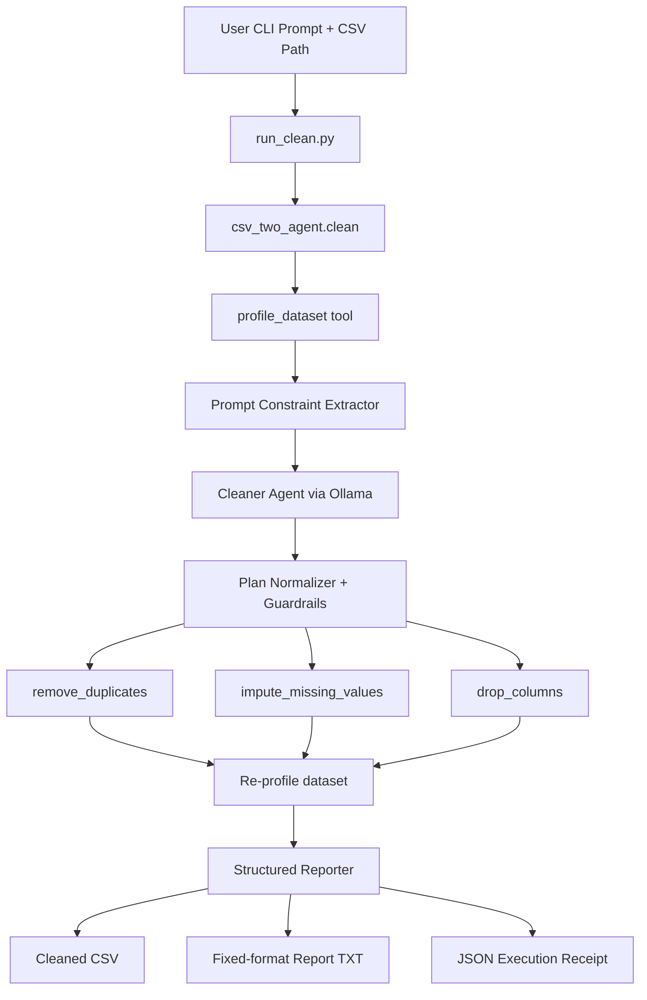

# CSV Cleaning AI Agent (CS4680 Final Project)

This repository presents a final project for CS4680 focused on building a reliable CSV data-cleaning agent. The system is designed as a command-line-first application that combines language-model planning, structured tool execution, and deterministic reporting. The core idea is to separate flexible reasoning from high-confidence data operations, so that the model can interpret user intent while the tool layer guarantees predictable behavior.

**Short Version (At a Glance)**
- Architecture: tool-augmented multi-agent pipeline (planner + executor/reporter flow).
- Core method: LLM plans actions, MCP-style tools execute actions deterministically.
- Main outputs: cleaned CSV, fixed-format text report, JSON execution receipt.
- Evidence: benchmark runs in `mcp_csv_server/test_data/benchmarks/`.

## 1. Introduction

### 1.1 LLM to Prompt Engineering to Agentic Systems
Large language models are effective at interpreting ambiguous user requests, but they are often less reliable when they are asked to directly execute strict data-processing tasks. This project addresses that gap by using prompt engineering as a planning mechanism and a tool-augmented architecture as an execution mechanism. In other words, the model decides what should be done, and the tools decide how it is done with schema validation and deterministic outputs.

### 1.2 Motivation: Why Static Prompts Are Not Enough
Static prompts are insufficient for practical CSV cleaning because each dataset has different characteristics, including different missing-value distributions, different duplicate rates, different column types, and different user priorities. A one-size-fits-all prompt cannot adapt to these conditions in a robust way. As a result, a dynamic pipeline that profiles the dataset at runtime and then plans actions from measurable statistics is more suitable than a fixed prompt template alone.

### 1.3 Problem Statement
The project objective is to build an AI-assisted CSV cleaning system that can accept natural-language instructions, transform them into structured and auditable cleaning actions, apply those actions safely, and produce evidence that clearly explains what changed and why.

### 1.4 Approach and Architecture Choice
The implemented system follows a tool-augmented multi-agent pattern that combines A2A-style role separation with MCP-style structured tooling.

The architecture was chosen for three reasons. First, it preserves planner flexibility, because the LLM can adapt to different dataset profiles and user prompts. Second, it preserves execution reliability, because data changes are performed by validated tools rather than unconstrained model text. Third, it improves transparency, because the final output includes fixed-format reports and JSON execution receipts.

The current version does not use vector retrieval (RAG). Instead, the cleaner injects a local reasoning framework document into the planning context.

**Short Version**
- Static prompts alone were not enough for robust cleaning behavior.
- The chosen approach separates planning (LLM) from execution (tools).
- Guardrails are used to preserve protected columns and enforce valid actions.

## 2. Project Overview

### 2.1 End-to-End Behavior
Given a CSV file path and a prompt, the system first profiles the dataset to gather metrics such as missingness, duplicates, inferred data types, and cardinality. It then extracts prompt-level constraints, including protected columns and explicit replacement rules. After that, the planner agent proposes a structured action plan. The plan is normalized and validated before tools execute it. Once execution finishes, the system profiles the cleaned result again and generates a deterministic report that summarizes dataset changes, action traces, and quality checks.

### 2.2 Example Scenario
Consider the prompt, `Clean this dataset. PromoCode is important, do not drop it. If Transaction Date is empty replace with None.` In this scenario, the system interprets `PromoCode` as a protected column and prevents drop actions against it. It also recognizes the replacement rule for `Transaction Date` and selects constant imputation for that column. If additional columns remain incomplete, the normalization and fallback logic ensures they are still addressed.

### 2.3 System Classification
This project is best described as a multi-agent, tool-augmented system. It has planner and reporter responsibilities, explicit schema-governed tools, and policy guardrails that enforce user constraints during execution.

**Short Version**
- Type: multi-agent + tool-augmented.
- Input: CSV path + prompt.
- Output: cleaned dataset + auditable report artifacts.

## 3. System Architecture (Integrated View)

### 3.1 High-Level Design



The high-level architecture starts with user input and passes through an orchestration layer that coordinates profiling, planning, normalization, execution, and reporting. The important design principle is that the planner does not directly mutate data. It only emits an action proposal, and the tool layer performs the actual transformations.

### 3.2 Retrieval-Augmented Generation (RAG)
RAG is not implemented in this version. The system currently uses a local static guidance file, `csv_cleaning_reasoning_framework.txt`, which is injected into planner context together with the profile and prompt constraints.

If the system is extended in future work, a RAG version would add an embedding model, a vector store, a retrieval stage before planning, and a prompt format that explicitly follows `Context + Question + Instructions`.

### 3.3 MCP / Tool Interface
The MCP-style tool layer is implemented in `mcp_csv_server/mcp_server.py` and exposes structured operations for profiling, duplicate removal, missing-value imputation, and column dropping. Each tool uses typed input schemas and predictable output payloads.

The planner is instructed to return strict JSON actions. After generation, the plan is normalized so invalid actions are filtered, unsupported strategies are corrected, and protected-column policies are enforced. Tool outputs are then collected into `execution_results`, which are reused by the reporting stage.

This design demonstrates the key MCP principle used in the project: standardized context and structured tool communication reduce ambiguity and improve reproducibility.

### 3.4 A2A (Agent-to-Agent Architecture)
The system separates responsibilities into a planner role and a reporter role. The planner decides what actions should be executed by analyzing the prompt and profile. The reporter summarizes objective before/after outcomes and execution evidence.

Communication is implemented through shared structured state, including `before_profile`, `plan`, `execution_results`, and `after_profile`. Control flow is sequential with iterative refinement, because the pipeline can run multiple passes and re-profile between passes to improve coverage.

### 3.5 Data Flow
The complete data flow can be summarized as follows. The user provides a CSV path and prompt. The system profiles the dataset and extracts prompt constraints. The planner creates an action proposal. Guardrails normalize and validate the proposal. Deterministic tools execute the approved actions. The cleaned dataset is profiled again. Finally, a fixed-format text report and JSON execution evidence are written to disk.

**Short Version**
1. Profile dataset.
2. Extract prompt constraints.
3. Generate and normalize plan.
4. Execute tools.
5. Re-profile and report.

## 5. Prompt Engineering Strategy (Core)

### 5.1 Base Prompt Design
The base planner prompt defines the agent role, the expected action schema, the allowed operation types, and strategy constraints. It also includes policy language that explicitly states that important or protected columns must not be dropped.

### 5.2 Prompting with RAG (If Applicable)
Because no retriever is currently used, this section is implemented as static context injection. The reasoning framework text is appended to planner input to provide decision criteria. Although this is not retrieval, it serves as a controlled context source.

### 5.3 Prompting for Tool Use (MCP)
Prompting for MCP-style behavior is designed around strict machine-readable output. The planner is required to emit JSON action records that map directly to tool calls. This reduces free-form responses and helps prevent non-executable outputs.

### 5.4 Multi-Agent Prompting (A2A)
Prompting differs by role. The planner prompt emphasizes action correctness, policy compliance, and schema structure. The reporter stage emphasizes consistency and auditability by producing deterministic report sections. This role separation improves both execution safety and readability of results.

### 5.5 Iterative Refinement
Several practical issues appeared during development. Early versions occasionally omitted missing columns, generated incomplete action payloads, or handled protected-column constraints inconsistently. These issues were addressed with plan normalization, fallback planning, explicit protected-column enforcement, and a coverage safeguard that ensures missing-value columns are not silently ignored.

**Short Version**
- Early issue: incomplete or inconsistent model plans.
- Fix: normalization + fallback + coverage safeguards.
- Result: more reliable and reproducible cleaning runs.

## 6. Implementation

### 6.1 Technology Stack
The implementation uses Python with FastAPI, Pydantic, Pandas, and Requests. The planner interacts with a local Ollama endpoint (default model setting: `llama3`).

### 6.2 Code Organization
The main orchestration logic is in `csv_two_agent.py`. Tool implementations and schema definitions are in `mcp_csv_server/mcp_server.py`. The command-line entrypoint is `run_clean.py`. Operational guidance and benchmark commands are documented in `how_to_run.md`, and the reasoning policy reference is stored in `csv_cleaning_reasoning_framework.txt`.

### 6.3 How to Run
Activate the virtual environment with:

```bash
source venv/bin/activate
```

Run direct mode with:

```bash
python run_clean.py \
  --file mcp_csv_server/test_data/inputs/sample_dataset_100.csv \
  --prompt "Clean this dataset."
```

Save benchmark evidence JSON with:

```bash
python run_clean.py \
  --file mcp_csv_server/test_data/inputs/sample_dataset_100.csv \
  --prompt "Clean this dataset." \
  --save-json mcp_csv_server/test_data/benchmarks/benchmark_1_baseline.json
```

**Short Version**
- Use direct CLI mode for fastest local testing.
- Add `--save-json` to preserve grading evidence.
- Run the three benchmark prompts from `how_to_run.md` for final demos.

## Examples and Case Studies

### Case Study 1: Baseline Cleaning
Evidence file: `mcp_csv_server/test_data/benchmarks/benchmark_1_baseline.json`.

In the baseline run, the system processes `sample_dataset_100.csv` with the generic prompt `Clean this dataset.` The result shows a row count reduction from 100 to 20, which corresponds to the removal of 80 duplicate records. Missing cells decrease from 30 to 0, and duplicate count decreases from 80 to 0. This run demonstrates that the profile-driven fallback and normalization logic can produce complete cleanup behavior even when the prompt is minimal.

**Short Result**
- Rows: `100 -> 20`
- Missing cells: `30 -> 0`
- Duplicates: `80 -> 0`

### Case Study 2: Prompt-Constrained Cleaning
Evidence file: `mcp_csv_server/test_data/benchmarks/benchmark_2_prompt_constraints.json`.

In this run, the prompt introduces user constraints, including protected fields and a custom replacement rule for `color`. The system preserves protected columns and applies constant imputation for `color` with the specified value `None`. The overall duplicate cleanup remains effective, with duplicates reduced from 80 to 0. This case demonstrates that prompt constraints are not only parsed but also enforced through policy checks.

**Short Result**
- Protected-column behavior: enforced.
- Custom fill behavior: `color -> None` action applied.
- Duplicates: `80 -> 0`.

### Case Study 3: Dirty Cafe Dataset
Evidence file: `mcp_csv_server/test_data/benchmarks/benchmark_3_dirty_cafe.json`.

This scenario uses a larger and noisier dataset. The prompt protects `PromoCode` and requests replacement behavior for empty `Transaction Date` entries. The system retains `PromoCode` and executes multiple imputation actions across missing columns. Although the action trace includes constant fill for `Transaction Date`, the post-profile still reports non-zero missing values for that column. This highlights an edge case involving literal `None` semantics and CSV parsing behavior, which is documented as a known limitation.

**Short Result**
- `PromoCode` protection: successful.
- Prompted `Transaction Date` replacement action: executed.
- Remaining gap: null-literal parsing edge case.

## Limitations
The current system does not include a vector-based retrieval pipeline, so contextual guidance comes from static framework injection rather than semantic retrieval. It also does not yet include dedicated type-coercion or outlier-handling tools, even though those topics are discussed in the reasoning framework. Another known limitation is that null-like literal values such as `None` can interact with CSV parsing rules in ways that produce unexpected missingness outcomes. Finally, runtime can increase on larger files because profiling and execution involve repeated read/write cycles.

**Short Version**
- No true RAG yet.
- No dedicated coercion or outlier tools yet.
- `None` literal handling can be inconsistent in some flows.

## Lessons Learned
The project demonstrates that prompt engineering alone is not enough for reliable data cleaning and that explicit guardrails are necessary. It also shows that structured tool schemas significantly reduce hallucinated actions and improve execution reliability. Deterministic reporting proved valuable for comparative evaluation across benchmark runs, especially in a course setting where reproducibility matters. A major practical lesson is that fallback logic should always be present, because even constrained LLM outputs can be incomplete. Another important takeaway is that small wording changes in prompts can meaningfully shift action planning, so policy-level normalization is essential.

**Short Version**
- Prompting works best when paired with constraints.
- Schema-based tools improve reliability.
- Reproducible reports make evaluation easier.

## Conclusion
This project delivers a practical hybrid AI cleaning pipeline that balances model flexibility with deterministic execution. The benchmark artifacts show strong baseline cleaning performance and meaningful responsiveness to user constraints. At the same time, the project surfaces realistic edge cases that motivate future work, including robust null-literal handling and optional RAG integration for richer contextual guidance.

**Short Version**
- The system is effective, auditable, and demo-ready.
- Next step: improve null handling and optionally add RAG.

## Project File Map
The orchestration pipeline is implemented in `csv_two_agent.py`, the tool layer is in `mcp_csv_server/mcp_server.py`, and the CLI interface is provided by `run_clean.py`. Inputs are located under `mcp_csv_server/test_data/inputs/`, outputs under `mcp_csv_server/test_data/outputs/`, and benchmark evidence under `mcp_csv_server/test_data/benchmarks/`.
